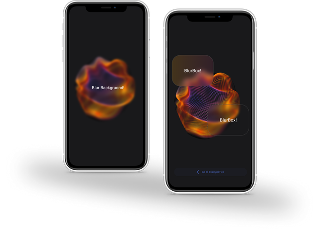

# BlurBox


# Introduction

### A widget that applies a blur effect to its child widget.<br/>

It works like the Container widget and gives you all the features that the container has,
with the difference that this container is BlurBox


# Installation

```yaml
dependencies:
  blurbox: 0.0.4
```
or 
```bash
flutter pub add blurbox
```

```dart
import 'package:blurbox/blurbox.dart';
```

# Usage

The `BlurBox` widget takes a child widget and applies a blur effect to it.
You can customize the blur amount, color, elevation, padding, and various other styling options.

### BlurBox

```dart
BlurBox(
blur: 5.0, // Adjust the blur amount
color: Colors.white.withOpacity(0.1), // Set a transparent background
  child: Text('This text is blurred!'),
)
```
### Blur Background!
```dart
BlurBox(
width: double.infinity,
height:double.infinity,
blur: 5.0, 
child: const Center(
  child: Text(
    'Blur Background!',
     style: TextStyle(fontSize: 24.0),
    ),
  ),
),
```

### PresetBlurBox !
```dart
PresetBlurBox(
preset: BlurPreset.heavy,
child: Center(
       child: Text(
              'Heavy Blur',
              style: TextStyle(fontSize: 24, color: Colors.white),
              ),
      ),
)
```
### AnimatedBlurBox 
```dart
AnimatedBlurBox(
duration: Duration(seconds: 1),
curve: Curves.easeInOut,
borderRadius: BorderRadius.circular(20),
child:Center(
      child: Text(
              'Blur Me!',
             ),
      ),
)
```
### ThemedBlurBox
```dart
ThemedBlurBox(
  child: Text('blur by surface color in the theme'),
)
```
### .blurry ext

```dart
Text('BlurBox').blurry(
          blur: 10,
          color: Colors.blue.withOpacity(0.2),
          borderRadius: BorderRadius.circular(15),
          padding: EdgeInsets.symmetric(horizontal: 20, vertical: 10),
        ),
```


### Available Widgets

## BlurBox
The core widget that applies a blur effect to its child.

## AnimatedBlurBox
A widget that provides animated transitions when changing blur values.

## ThemedBlurBox
Automatically adapts the blur box's colors to match the current app theme.

## PresetBlurBox
Offers predefined blur styles (`soft`, `heavy`, `subtleShadow`) for quick and easy use.


> [!IMPORTANT]
> When you use blur in a scrollable view and have a problem with rendering, write the physics of your scroll view in the following way to solve your problem.

```dart
ListView(
physics: const AlwaysScrollableScrollPhysics()
               .applyTo(const BouncingScrollPhysics()
               ),
children: [...]
)
```

# Features

- **BlurBox:** The main widget for applying blur effects with extensive customization options.
- **AnimatedBlurBox:** Provides smooth animations for changing blur values.
- **ThemedBlurBox:** Automatically adjusts blur and colors based on the current theme of the application.
- **PresetBlurBox:** Offers predefined blur configurations for quick setup.

# Customization

**Explore the various properties of `BlurBox` to customize its appearance and behavior:**

* `keyy`:The key of the widget.
* `blur`: Controls the blur intensity (`default`: `5.0`).
* `color`: Sets the background color of the BlurBox (`default`: `transparent`).
* `height` and width: Define the size of the BlurBox.
* `elevation`: Applies a shadow effect to the BlurBox.
* `padding`: Adds padding around the child widget.
* `margin`: Adds margin around the BlurBox.
* `alignment`: Positions the child widget within the BlurBox.
* `clipBehavior`: Determines how the child widget is clipped (`default`:`Clip.none`).
* `constraints`: Applies constraints to the child widget.
* `foregroundDecoration`: Applies decoration to the foreground of the BlurBox.
* `borderRadius`: Sets the border radius of the BlurBox.
* `border`: Defines a border for the BlurBox.
* `backgroundBlendMode`: Controls how the background and child are blended.
* `boxShadow`: Creates shadows on the BlurBox.
* `gradient`: Applies a gradient to the background of the BlurBox.
* `image`: Sets an image as the background of the BlurBox.
* `shape`: Defines the shape of the BlurBox (`default`: `BoxShape.rectangle`).
  <br/><br/>

___


